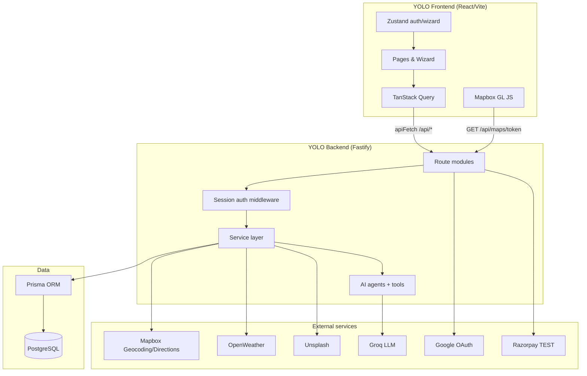
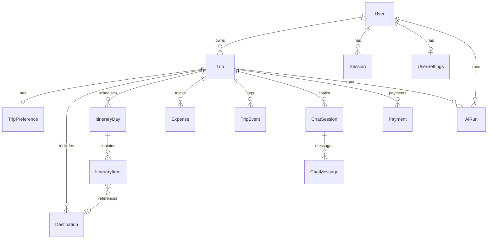
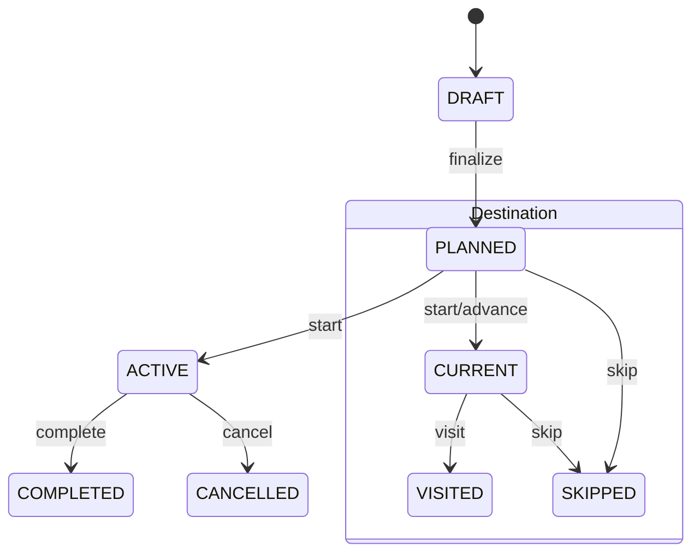

# YOLO Architecture & Engineering

**Milestone 21.2** — documents the system as implemented in this repository (through Milestone 20 + post-M20 refinement). For setup and run instructions see the root [README](../README.md). For focused topic guides see [authentication](./authentication.md), [database](./database.md), [AI agents](./ai-agents.md), [AI tools](./ai-tools.md), [security](./security.md), [payments](./payments.md), and [evaluation](./evaluation.md).

---

## 1. System overview

YOLO is an AI-native travel agent: users plan multi-stop journeys, optimize itineraries, run trips live with maps and progress tracking, manage expenses, and chat with a travel copilot. The product is a **monorepo** with a React SPA, a Fastify REST API, PostgreSQL persistence, and server-side integrations (maps, weather, images, LLM, payments).

```
User (browser)
      │
      ▼
┌─────────────────────────────────────┐
│  Frontend — React 19 + Vite         │
│  TanStack Query · Zustand · Mapbox  │
└─────────────────────────────────────┘
      │  HTTPS / cookies (session)
      ▼
┌─────────────────────────────────────┐
│  Backend — Fastify REST API         │
│  Auth · Trips · Places · AI · Live  │
└─────────────────────────────────────┘
      │
      ├──► PostgreSQL (Prisma ORM)
      │
      └──► External services
            Mapbox · OpenWeather · Unsplash · Groq · Google OAuth · Razorpay (test)
```

| Layer | Responsibility |
|-------|----------------|
| **Frontend** | UI, routing, client state, map rendering (public Mapbox token from backend), wizard UX |
| **Backend API** | Auth, validation, trip ownership, orchestration of services and AI agents |
| **Application services** | Deterministic business logic: routes, discovery corridor, optimization persistence, live trip state, expenses |
| **AI layer** | LLM reasoning/enrichment with tool grounding and deterministic fallbacks |
| **Database** | Users, trips, destinations, itineraries, expenses, chat, payments, audit (`AiRun`, `TripEvent`) |
| **External APIs** | Factual/geospatial data and model inference — always called from backend (except Mapbox GL in browser) |

---

## 2. Architecture diagram



---

## 3. Repository layout

```
TravelBucket/
├── frontend/          React SPA (src/features/*, components, layouts)
├── backend/           Fastify server (src/routes, services, ai)
├── prisma/            schema.prisma, migrations, seed.js
├── tests/             Vitest unit tests, Playwright e2e, AI evaluation scenarios
└── docs/              Architecture & feature documentation
```

**Entry points**

- Frontend: `frontend/src/main.jsx` → `App.jsx` (lazy-loaded routes)
- Backend: `backend/src/server.js` → `buildApp()` in `backend/src/app.js`

---

## 4. Frontend architecture

### Stack

- **React 19** + **Vite 6**
- **React Router** — public routes + `ProtectedRoute` for authenticated areas
- **TanStack Query** — server state (trips, destinations, explore feeds)
- **Zustand** — auth bootstrap (`authStore`) and wizard draft trip (`wizardStore`)
- **Tailwind CSS** — design tokens via CSS variables (light/dark)
- **Mapbox GL JS** — maps; token fetched from backend (`GET /api/maps/token`), never hardcoded

### Routing structure

| Area | Paths | Notes |
|------|-------|-------|
| Public | `/`, `/login`, `/signup`, static info pages | Landing, auth |
| Dashboard | `/dashboard`, `/explore`, `/trips`, `/expenses` | Command center + discovery |
| Planning wizard | `/trips/new/{basics,transport,booking,stay,discover,select,optimize,review}?tripId=` | `WizardLayout` stepper |
| Trip detail | `/trips/:tripId` | Overview, itinerary, map widget |
| Live trip | `/trips/:tripId/active`, `/active/map`, `/active/copilot` | ACTIVE status |
| Account | `/profile`, `/settings` | Profile + preferences |

Wizard phases are defined in `frontend/src/layouts/WizardLayout.jsx`: **Where → Travel → Experience → Itinerary → Review**.

### API communication

All authenticated calls use `frontend/src/services/api.js`:

- `fetch('/api/...', { credentials: 'include' })` — session cookie `yolo_session`
- Vite dev proxy forwards `/api` → `https://yolo-backend-t28z.onrender.com`
- Errors throw with `error.message` from JSON body

### Key UI modules

| Module | Role |
|--------|------|
| `MapPanel` / `CompactRouteMap` | Route lines, markers, fitBounds |
| `RouteSuggestions` | Along-route stop cards (Add/Skip) on Basics step |
| `TravelImage` | Destination images with compact text fallback |
| `PopularDestinationsSection` | Dashboard/Explore discovery rails |
| `AppShell` | Nav shell for authenticated pages |
| `ErrorBoundary` | Graceful crash recovery |

### Typical planning UI flow

```
BasicsPage (origin/dest + map + route suggestions)
  → POST /api/trips or PATCH basics
  → POST /api/places/route-suggestions (parallel)
  → POST /api/trips/:id/route-stops (accepted stops)
TransportPage → PATCH transport
BookingPage / StayPage → bookings + stay preferences
DiscoverPage → POST /api/trips/:id/discover
SelectPage → PATCH destinations, reorder
OptimizePage → POST /api/trips/:id/optimize
ReviewPage → POST finalize → /trips/:id
```

---

## 5. Backend architecture

### Stack

- **Fastify 5** — HTTP server, plugins: `@fastify/cookie`, `@fastify/cors`, `@fastify/rate-limit`
- **Prisma** — database access (`backend/src/db/prisma.js`)
- **Zod** — request validation (trip validators, auth payloads)
- **Service layer** — business logic separated from route handlers

### Route organization

Routes are registered in `backend/src/app.js` under `/api`:

| Module | Prefix / paths | Purpose |
|--------|----------------|---------|
| `health.routes` | `GET /health` | Liveness + DB check |
| `auth.routes` | `/auth/*` | Login, signup, OAuth, profile, settings, sessions |
| `trip.routes` | `/trips/*` | CRUD, basics, transport, bookings, stay |
| `maps.routes` | `/maps/*` | Geocode, directions, Mapbox public token |
| `weather.routes` | `/weather` | OpenWeather proxy |
| `places.routes` | `/places/*` | Route suggestions, search, popular/vibes |
| `destination.routes` | `/trips/:id/discover`, destinations, route-stops | Discovery pipeline |
| `itinerary.routes` | `/trips/:id/optimize`, `/finalize`, itinerary GET |
| `replan.routes` | `/trips/:id/replan/preview`, `/apply` | Live replanning |
| `live.routes` | `/trips/:id/start`, `/live`, visit/skip | Active trip |
| `expense.routes` | `/trips/:id/expenses`, `/budget` | Expense CRUD + analysis |
| `copilot.routes` | `/trips/:id/copilot/*` | Chat sessions |
| `summary.routes` | `/trips/:id/summary` | Post-trip narrative |
| `payment.routes` | `/trips/:id/payments/*` | Razorpay concierge (test) |
| `ai.routes` | `/ai/health`, `/ai/tools` | Tool registry introspection |

### Cross-cutting concerns

- **`requireAuth`** (`auth.middleware.js`) — validates session cookie, attaches `request.user`
- **`getOwnedTrip(tripId, userId)`** — every trip mutation verifies ownership
- **Global rate limit** — 300 requests/minute
- **Error handler** — 4xx message to client; 5xx generic message, logged server-side

### Why services exist

Routes stay thin; services encapsulate multi-step workflows (e.g. discovery pipeline, optimization persistence, live progress calculation). This keeps AI agents and deterministic logic composable and testable.

---

## 6. Database architecture

PostgreSQL via Prisma. Full schema: `prisma/schema.prisma`.

### Core entities

| Model | Purpose |
|-------|---------|
| `User` | Account (email, optional Google, password hash) |
| `Session` | Hashed session tokens, expiry, user agent |
| `UserSettings` | Theme, notifications, travel preferences |
| `Trip` | Origin/destination, dates, budget, status (`DRAFT` → `PLANNED` → `ACTIVE` → `COMPLETED`) |
| `TripPreference` | Per-trip interest flags (nature, culture, food, …) |
| `Destination` | Stops along journey; `selected`, `status`, scores, geo |
| `ItineraryDay` / `ItineraryItem` | Optimized schedule (day 0 = travel leg) |
| `Booking` | Transport/stay booking records (wizard) |
| `Expense` | Trip spend by category |
| `TripEvent` | Audit trail (started, visited, skipped, replanned, …) |
| `ChatSession` / `ChatMessage` | Copilot history |
| `Payment` | Razorpay concierge orders |
| `AiRun` | LLM call telemetry |

### ER diagram (simplified)



**Important:** Intermediate stops are not a separate table — they are `Destination` rows with `selected: true`, ordered by `sortOrder`, with lifecycle `DestinationStatus` (`PLANNED` → `CURRENT` → `VISITED` / `SKIPPED`).

---

## 7. AI architecture

YOLO is **not** “user message → LLM → answer” for core planning. AI **enriches and ranks** structured candidates; **deterministic code** handles routes, distances, persistence, and fallbacks.

### Three-way split

| Kind | Examples | Where |
|------|----------|-------|
| **Deterministic logic** | Mapbox directions, polyline distance, progress %, budget totals, itinerary persistence | `places.service.js`, `liveTrip.service.js`, `expense.calculator.js`, `optimizer.service.js` |
| **External factual data** | Coordinates, driving geometry, weather, place names | Mapbox, OpenWeather, Unsplash |
| **AI reasoning** | Rank discovery candidates, generate day plans, copilot replies, replan diffs, trip summary | Groq via agents in `backend/src/ai/agents/` |

### Agents

| Agent | File | Role |
|-------|------|------|
| `TravelDiscoveryAgent` | `travelDiscovery.agent.js` | Rank/enrich corridor candidates from discovery pipeline |
| `TripOptimizerAgent` | `tripOptimizer.agent.js` | Build feasible multi-day itinerary from selected stops |
| `TravelCopilotAgent` | `travelCopilot.agent.js` | Conversational assistant with **tool calls** |
| `ReplanningAgent` | `replanning.agent.js` | Preview itinerary diff when plans change |
| `TripSummaryAgent` | `tripSummary.agent.js` | Post-trip narrative |
| `BudgetAgent` | `budget.agent.js` | Budget analysis narrative (with calculator fallback) |

### Infrastructure

- **`GroqProvider`** — chat completions, JSON mode, logging to `AiRun`
- **`GroqKeyPool`** — rotates up to 5 API keys with cooldown
- **Tool registry** — `backend/src/ai/tools/index.js` (weather, route, budget, itinerary, …)
- **Schemas** — `backend/src/ai/schemas/agent.schemas.js` (Zod validation of LLM JSON)

Copilot messages invoke tools server-side; the LLM does not invent weather, ETA, or budget numbers.

### Fallback behavior

If Groq is unavailable or returns invalid JSON:

- Discovery → deterministic ranking of geocoded candidates
- Optimizer → rule-based day assignment (`optimizer.service.js` fallback path in agent)
- Copilot → honest limitation message; tools still callable where APIs work
- Status recorded as `AiRunStatus.FALLBACK`

---

## 8. Route-aware intermediate place discovery

YOLO does **not** search only around the destination. Both **Basics** (lightweight) and **Discover** (full pipeline) use a **route corridor** model.

### Conceptual pipeline

```
Origin + Destination
        │
        ▼
Mapbox driving route (full geometry)
        │
        ▼
Sample points along route (by distance %, excluding endpoint zones)
        │
        ├── Reverse geocode → towns/districts on corridor
        └── Forward search (interest queries, bbox + country=IN)
        │
        ▼
Filter: polyline distance, min distance from origin/dest,
        exclude endpoint name matches, dedupe by proximity
        │
        ▼
Rank (type score, mid-route bonus, detour distance)
        │
        ├── Basics: GET/POST route-suggestions → user Add/Skip → route-stops
        └── Discover: TravelDiscoveryAgent → Destination rows (selected=false)
        │
        ▼
User selects stops → Optimize → Itinerary
```

### Implementation files

| Stage | Service / route |
|-------|-----------------|
| Route + geometry | `places.service.js` → `getRoute()` |
| Corridor math | `distanceToPolylineKm`, `sampleRoutePointsByDistance`, `routeBoundingBox` |
| Basics suggestions | `routeSuggestions.service.js` → `POST /api/places/route-suggestions` |
| Persist accepted basics stops | `addRouteStopsToTrip` → `POST /api/trips/:id/route-stops` |
| Full AI discovery | `discovery.service.js` → `POST /api/trips/:id/discover` |

Transport mode adjusts max off-route distance (e.g. bike/car vs train/flight).

---

## 9. Trip planning pipeline

End-to-end lifecycle (matches wizard + API):

1. **Basics** — User sets origin, destination, dates, budget, interests. Map shows route; corridor suggestions offered. Trip created/updated (`DRAFT`).
2. **Transport** — Mode selected (`TransportMode` enum).
3. **Booking** — Optional booking records attached.
4. **Stay** — Accommodation preferences captured.
5. **Discover** — Full discovery pipeline runs; candidates stored as `Destination` (`selected: false`).
6. **Select** — User toggles selection, reorders (`sortOrder`).
7. **Optimize** — `runOptimization()` fetches weather for stops, calls `TripOptimizerAgent`, persists `ItineraryDay`/`ItineraryItem` (day 0 = travel leg).
8. **Review** — User accepts; `finalize` sets trip to `PLANNED`.
9. **Start** — `startTrip()` → `ACTIVE`, first stop `CURRENT`.

Draft trips can be resumed via `?tripId=` on wizard routes.

---

## 10. Live trip architecture

After `POST /api/trips/:id/start`:

| Concern | Implementation |
|---------|----------------|
| Status | `Trip.status = ACTIVE`, `startedAt` set |
| Current stop | First selected destination → `CURRENT` |
| Progress | `calculateProgress()` — visited / (selected non-skipped) |
| Visit | `POST .../destinations/:id/visit` → `VISITED`, advance `CURRENT` |
| Skip | `POST .../skip` → may trigger replan preview |
| Live payload | `GET /api/trips/:id/live` — current, next, progress |
| Map | Frontend geolocation + directions to next stop |
| Expenses | Same expense APIs, optional geo on entries |
| Copilot | `ChatMode.ACTIVE_TRIP`, quick actions (ETA, food, replan) |
| Replan | Preview diff → apply re-runs optimizer on **remaining** stops only |
| Complete | `POST /api/trips/:id/complete` → summary generation |

State transitions are persisted on `Destination.status` and logged in `TripEvent`.



---

## 11. External services

| Service | Env var | Called from | Purpose | Fallback |
|---------|---------|-------------|---------|----------|
| **Mapbox** | `MAPBOX_ACCESS_TOKEN` | Backend geocode/directions; frontend map via public `pk.` token endpoint | Routes, places search, reverse geocode | 503/502 errors; map panel shows message |
| **OpenWeather** | `OPENWEATHER_API_KEY` | Backend `weather.service.js` | Forecast/current for optimizer & copilot tool | Optimizer/copilot continues without weather block |
| **Unsplash** | `UNSPLASH_ACCESS_KEY` | Backend `unsplash.service.js` | Destination/discovery images | Curated CDN URLs in `popularDestinations.js`; null imageUrl |
| **Groq** | `GROQ_API_KEY_1..5` | Backend AI agents only | LLM inference | Deterministic agent fallbacks; `AiRun` status FALLBACK |
| **Google OAuth** | `GOOGLE_CLIENT_*` | Backend auth routes | Social login | Local email/password auth still available |
| **Razorpay** | `RAZORPAY_KEY_*` | Backend payment routes | Test-mode concierge checkout | UI labels TEST MODE; verify server-side only |

**Security rule:** Secret keys (`sk.` Mapbox, Groq, Razorpay secret) never ship to the browser. Mapbox GL receives only public `pk.` tokens from `GET /api/maps/token`.

---

## 12. Security architecture

| Mechanism | Implementation |
|-----------|----------------|
| Authentication | Session cookie `yolo_session`, HTTP-only; token hashed in `Session` table |
| Passwords | bcrypt hashes (`password.service.js`); strength endpoint |
| Authorization | `requireAuth` + `getOwnedTrip` on all trip-scoped routes |
| OAuth | State cookie on Google flow; safe redirect validation on frontend |
| CORS | Restricted to `FRONTEND_URL` with credentials |
| Rate limiting | 300 req/min global |
| Input validation | Zod on trip/auth payloads; copilot message length cap |
| Secrets | `.env` at repo root; `.env.example` documents variables |
| Payments | HMAC verify on Razorpay callback; never trust client-only success |

See [security.md](./security.md) and [authentication.md](./authentication.md) for endpoint-level detail.

---

## 13. Testing

| Type | Location | Command |
|------|----------|---------|
| Unit tests | `tests/unit/*.test.js` | `npm test` |
| AI evaluation scenarios | `tests/ai-evaluation/scenarios.js` | `npm test -- tests/unit/ai-evaluation.test.js` |
| E2E | `tests/e2e/` (Playwright) | `npm run test:e2e` |

**Coverage highlights (actual tests):**

- Auth redirect safety, trip validators, trip progress math
- Itinerary/travel logic, budget/live calculations
- AI discovery constraints, copilot/replan flows
- Route corridor helpers (`route-corridor.test.js`)
- E2E: landing page smoke

There is **no** large integration test suite against a live Postgres in CI by default; local dev uses Docker Postgres + seed.

---

## 14. Engineering decisions

1. **AI does not compute routes or budgets** — Mapbox and `expense.calculator.js` produce facts; LLM explains and arranges.
2. **Discovery vs optimization separated** — Corridor search produces candidates; optimizer consumes **user-selected** stops only.
3. **Backend gateway for external APIs** — Keys, bbox filtering, and polyline math stay server-side.
4. **Destinations as unified stop model** — Basics route-stops, discovery candidates, and itinerary items share `Destination` + optional `ItineraryItem.destinationId`.
5. **Corridor-not-destination discovery** — Polyline distance + endpoint exclusion prevents “destination-only” recommendations (see §8).
6. **Persisted trip state enables live + replan** — Status on destinations and events allows progress, skip, and partial re-optimization.
7. **Graceful AI degradation** — Product remains usable when Groq fails; runs logged for observability.

---

## 15. Failure and fallback behavior

| Failure | Behavior |
|---------|----------|
| Mapbox down / unconfigured | API 502/503; map component shows error panel; route suggestions return empty |
| No corridor candidates | Discover may return fewer cards; user can continue planning with origin/dest only |
| Groq failure | Agent fallbacks; `AiRun.status = FALLBACK` |
| Unsplash failure | `imageUrl` null; frontend `TravelImage` shows compact label fallback |
| AI invalid JSON | Parsed with schema validation; fallback planner path |
| DB error | 500 from error handler; frontend ErrorState where implemented |
| Unauthenticated API | 401; `ProtectedRoute` redirects to login |
| Invalid input | 400 with message from validators |

---

## 16. Related documentation

| Document | Topic |
|----------|-------|
| [database.md](./database.md) | Models, seed data, Prisma commands |
| [ai-agents.md](./ai-agents.md) | Agent list and fallbacks |
| [ai-tools.md](./ai-tools.md) | Copilot tool registry |
| [evaluation.md](./evaluation.md) | AI scenario evaluation |
| [payments.md](./payments.md) | Razorpay test flow |
| [authentication.md](./authentication.md) | OAuth and sessions |

---

*This document reflects the codebase at Milestone 21.2. If implementation changes, update this file accordingly — do not treat it as aspirational architecture.*
